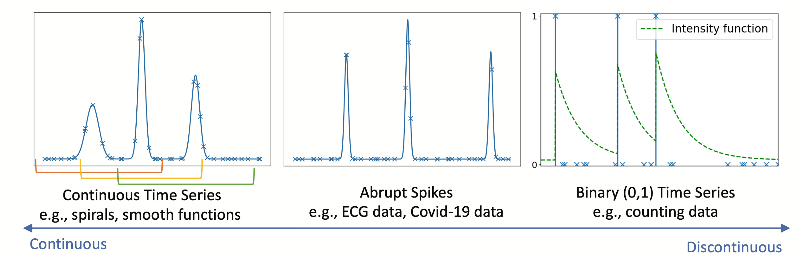
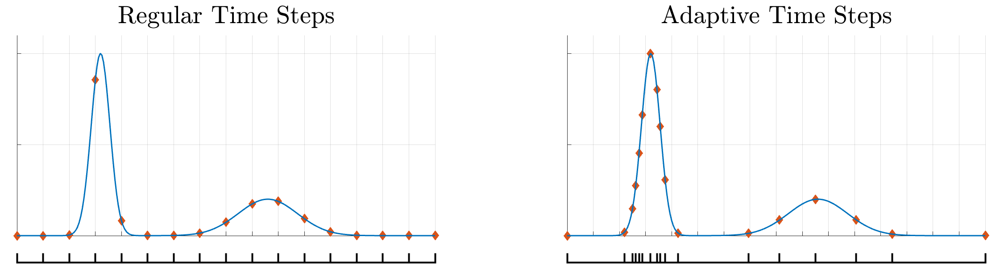
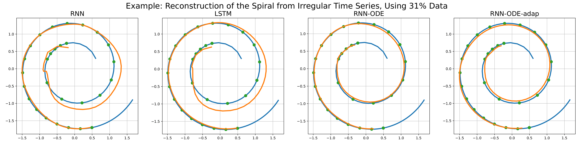

# RNN-ODE with Adaptive Time Steps

This repo contains the official implementation for the paper **[Neural Differential Recurrent Neural Networks with Adaptive Time Steps](https://arxiv.org/abs/2306.01674)** \
by Yixuan Tan, [Liyan Xie](https://liyanxie.github.io/), and [Xiuyuan Cheng](https://sites.math.duke.edu/~xiuyuanc/).


We propose an RNN-ODE model with adaptive time steps, called RNN-ODE-Adap, that uses a RNN-ODE to represent the time development of the hidden states, and we adaptively select time steps based on the steepness of changes of the data over time so as to train the model more efficiently for the ``spike-like'' time series (see examples below). 

<br>

<p align="center">
  
  <br>
  <em><sub>Illustration of spike-like time series. The crosses denote the discretely sampled time steps, which can be irregular. In the left panel, the subsequences enclosed with the orange, yellow, and green brackets represent the (training or testing) windows generated from this sequence. The rightmost plot shows the binary event series data with the underlying intensity function of this non-homogenous Poisson process.</em>
</p>

<br>
  


The basic idea of adaptive time steps is captured in the figure below:

<br>

<p align="center">
  
  <br>
  <em><sub>Illustration of regular and adaptive time steps for a spike-like time series. Both plots consist of 16 time intervals: the left uses regular time steps, while the right utilizes adaptively selected steps based on the series' shape. </em>
</p>

<br>

## What does this code do?

This codebase contains functions needed for implementing RNN-ODE-Adap, and provide the code for reproducing the spiral example used in the paper, as shown below.

<br>

<p align="center">
  
  <br>
  <em><sub>Comparison of RNN, LSTM, RNN-ODE, RNN-ODE-Adap on the reconstruction of simulated spiral data using irregular time series. </em>
</p>

<br>

## How to run the code?

## References

If you find the code useful for your research, please consider citing

```bibtex
@misc{TXC2023adaptive,
      title={Neural Differential Recurrent Neural Network with Adaptive Time Steps}, 
      author={Yixuan Tan and Liyan Xie and Xiuyuan Cheng},
      year={2023},
      eprint={2306.01674},
      archivePrefix={arXiv},
      primaryClass={stat.ML},
      url={https://arxiv.org/abs/2306.01674}, 
}
```

This work is built upon some previous papers which might also interest you:

- Ricky TQ Chen, Yulia Rubanova, Jesse Bettencourt, and David K Duvenaud. "Neural ordinary differential equations." In Advances in Neural Information Processing Systems, 2018.

- Yulia Rubanova, Ricky TQ Chen, and David K Duvenaud. "Latent ordinary differential equations for irregularly-sampled time series." In Advances in Neural Information Processing
Systems, 2019.

- E Weinan. "A proposal on machine learning via dynamical systems." Communications in Mathematics and Statistics, 1(5):1–11, 2017.

